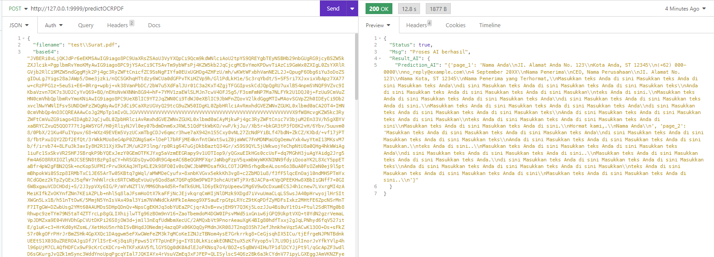

## Overview
The paddleocr-pdf-ocr repository hosts a project aimed at automating text extraction and recognition from PDF documents using PaddleOCR, a powerful OCR (Optical Character Recognition) tool based on deep learning techniques.

## API Usage
Send a POST request to /predictOCRPDF with a JSON body containing the Instagram comment to be analyzed:

```JSON
{
	"filename": str,
	"base64": str
}
```

The API will return the OCR result:

```JSON
{
	"Status": bool,
	"Msg": str,
	"Result_AI": {
		"Prediction_AI": dict,
	}
}
```
Example:




